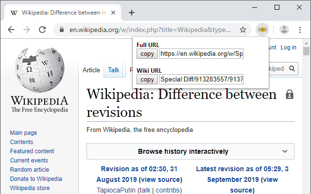

# Diff Link Simplifier
Simplifies links to MediaWiki diffs.

If you want to link to a diff on someone's talk page it's pretty ugly to include the full URL. It's possible to link to `Special:Diff` to create an internal link, but this involves extracting parts of the url and that is bothersome. This Chrome extension automatically creates the internal link for you so all you have to do is copy and paste it onto the talk page.

## Example


If you're on the page
```
https://en.wikipedia.org/w/index.php?title=Wikipedia&type=revision&diff=913786621&oldid=913283557
```
the extension generates the internal link
```
Special:Diff/913283557/913786621
```

## Features
* Works in all Chrome-based browsers.
* Requires no permissions.
* Works with any MediaWiki installation, including Fandom, Gamepedia, and Miraheze.

## Credits
Extension icon based on the [MediaWiki logo](https://commons.wikimedia.org/wiki/File:MediaWiki-notext.svg). Thanks to [Anthere](https://commons.wikimedia.org/wiki/User:Anthere) and all other users involved in the creation of the logo.
